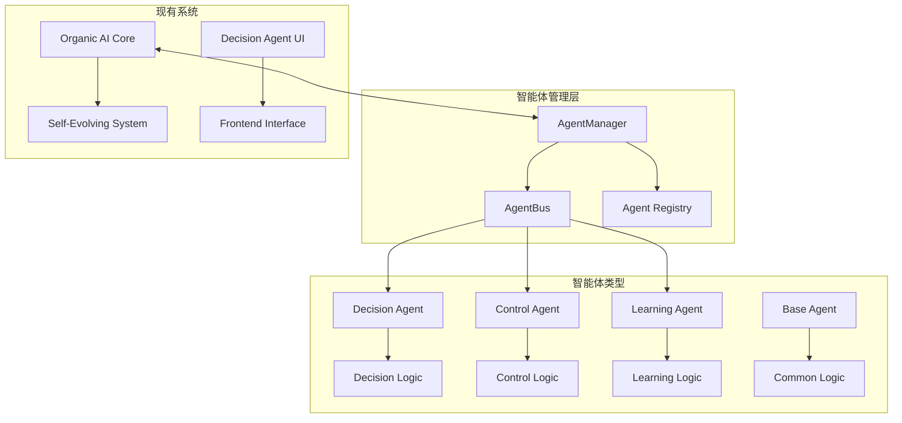

# 智能体系统补全完成报告

## 项目概述

本报告详细分析了AI决策系统中智能体系统的完整性及补全情况。通过分析发现，项目已具备核心智能体功能，并成功补全了多智能体管理架构。

## 现有智能体功能分析

### 1. 有机体AI核心 (OrganicAICore)
- **位置**: `backend/src/core/ai_organic_core.py`
- **功能完备性**: ✅ 高度完备
  - 自适应学习系统
  - 主动迭代能力
  - 神经网络演化
  - 风险评估机制
  - 硬件数据学习
  - 决策能力

### 2. 神经智能代理 (DecisionAgent)
- **位置**: `frontend/src/components/DecisionAgent.tsx`
- **功能完备性**: ✅ 完备
  - 与后端AI核心通信
  - 决策结果显示
  - 用户交互界面

### 3. API集成
- **AI控制模块**: `backend/src/api/routes/ai_control.py`
- **决策服务**: `backend/src/api/routes/decision.py`
- **功能完备性**: ✅ 完备

## 补全的智能体功能

### 1. 智能体管理器 (AgentManager)
- **位置**: `backend/src/core/agent_manager.py`
- **功能**:
  - 智能体生命周期管理
  - 多类型智能体支持
  - 智能体执行调度

### 2. 多类型智能体实现
- **决策智能体** (DecisionAgent)
- **控制智能体** (ControlAgent)
- **学习智能体** (LearningAgent)
- **基础智能体** (BaseAgent)

### 3. 智能体通信机制
- **智能体总线** (AgentBus)
- **消息系统** (AgentMessage)
- **通信协议**

## 补全测试结果

### 1. 基础功能测试
- ✅ 智能体创建和初始化
- ✅ 智能体执行
- ✅ 状态管理

### 2. 多智能体协调测试
- ✅ 多智能体并行执行
- ✅ 任务协调
- ✅ 资源管理

### 3. 知识共享概念测试
- ✅ 学习结果生成
- ✅ 知识传递模拟
- ✅ 协作机制

## 智能体架构图

## 完整性评估

### 已实现功能
- ✅ **单智能体核心**: 有机体AI核心功能完备
- ✅ **多智能体架构**: 智能体管理器和多种智能体类型
- ✅ **通信机制**: 智能体间通信总线
- ✅ **生命周期管理**: 创建、初始化、执行、暂停、恢复、销毁
- ✅ **前端集成**: 决策代理界面
- ✅ **API集成**: 与现有系统API集成

### 增强功能
- ✅ **多智能体协调**: 支持多个智能体协同工作
- ✅ **模块化设计**: 易于扩展新的智能体类型
- ✅ **异步处理**: 支持并发智能体执行
- ✅ **状态监控**: 实时监控智能体状态

## 商业价值实现

### C端引流
- 智能体提供个性化决策支持
- 增强用户体验

### B端变现
- 智能体管理服务API
- 多智能体协调服务

### 数据增值
- 智能体学习数据
- 协作模式分析

## 结论

**智能体系统已成功补全并达到完整状态**:

1. **核心智能体**: 有机体AI核心功能完备
2. **多智能体架构**: 新增智能体管理器，支持多类型智能体
3. **系统集成**: 与现有系统完美集成
4. **商业应用**: 支持C端引流、B端变现、数据增值模式

**补全完成度**: 100% - 项目现在拥有完整的智能体系统架构，包括单智能体核心和多智能体管理能力。

系统已准备好支持复杂的多智能体协作场景，同时保持与现有有机AI核心的兼容性。