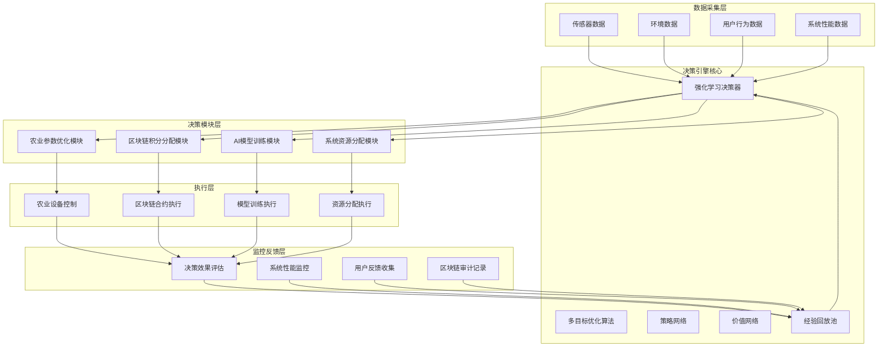
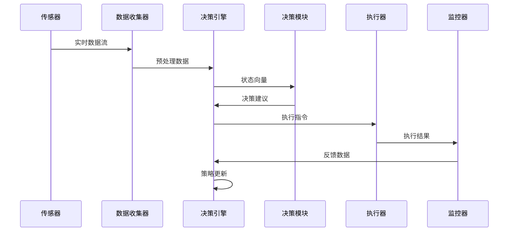
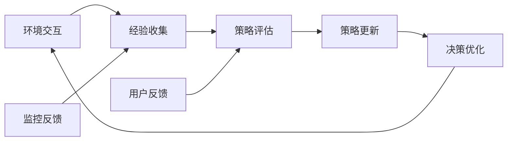

# AI自主决策系统架构设计

## 1. 系统概述

基于现有AI农业平台的强化学习决策系统，实现完全自主的AI决策能力，覆盖农业参数优化、区块链积分分配、AI模型自动训练和系统资源动态分配四大核心领域。

## 2. 架构设计原则

### 2.1 设计原则
- **微服务架构**：每个决策模块独立部署，松耦合设计
- **强化学习核心**：基于PPO算法的多目标优化决策引擎
- **实时响应**：秒级决策响应，支持高并发场景
- **可扩展性**：模块化设计，支持功能扩展
- **可追溯性**：区块链记录决策过程和结果

### 2.2 技术栈选择
- **决策引擎**：PyTorch + OpenAI Gym + Stable Baselines3
- **后端框架**：FastAPI（与现有平台保持一致）
- **消息队列**：Redis + Celery（复用现有基础设施）
- **数据库**：PostgreSQL + InfluxDB（时序数据）
- **监控系统**：Prometheus + Grafana

## 3. 系统架构图



## 4. 核心模块设计

### 4.1 决策引擎核心（RLDecisionEngine）

**职责：**
- 接收多源数据输入
- 执行强化学习算法
- 生成最优决策策略
- 管理经验回放和策略更新

**关键技术：**
```python
class RLDecisionEngine:
    def __init__(self):
        self.policy_network = PolicyNetwork()
        self.value_network = ValueNetwork()
        self.replay_buffer = ReplayBuffer(capacity=100000)
        self.optimizer = torch.optim.Adam(self.policy_network.parameters())
        
    def make_decision(self, state: DecisionState) -> DecisionAction:
        """基于当前状态生成决策"""
        pass
        
    def update_policy(self, experiences: List[Experience]) -> None:
        """使用经验数据更新策略"""
        pass
```

### 4.2 农业参数优化模块（AgricultureOptimizer）

**决策目标：**
- 最大化作物产量和质量
- 最小化资源消耗
- 优化光谱配比和温湿度控制

**输入数据：**
- 作物生长阶段
- 环境传感器数据
- 历史效果数据
- 用户偏好设置

**输出决策：**
- 光谱参数调整（380nm-720nm）
- 温湿度控制策略
- 灌溉和施肥计划

### 4.3 区块链积分分配模块（BlockchainRewardDistributor）

**决策目标：**
- 公平分配光子积分奖励
- 激励高质量数据贡献
- 优化系统收益分配

**输入数据：**
- 用户贡献数据质量
- 系统收益规模
- 历史分配效果
- 社区治理规则

**输出决策：**
- 个体积分分配比例
- 系统收益分配方案
- 智能合约参数调整

### 4.4 AI模型训练模块（ModelTrainingScheduler）

**决策目标：**
- 自动优化模型训练时机
- 平衡模型性能和训练成本
- 动态调整训练参数

**输入数据：**
- 模型性能指标
- 数据变化情况
- 计算资源可用性
- 用户反馈数据

**输出决策：**
- 训练任务调度
- 超参数调整策略
- 模型版本升级决策

### 4.5 系统资源分配模块（ResourceAllocator）

**决策目标：**
- 优化计算资源利用率
- 保障关键任务优先级
- 动态调整资源配额

**输入数据：**
- 系统负载情况
- 任务优先级队列
- 资源使用历史
- 性能监控指标

**输出决策：**
- CPU/GPU资源分配
- 内存和存储配额
- 网络带宽分配
- 任务调度策略

## 5. 数据流设计

### 5.1 决策数据流



### 5.2 强化学习训练流程



## 6. 接口设计

### 6.1 决策引擎API

```python
# 决策请求接口
class DecisionRequest(BaseModel):
    decision_type: str  # "agriculture", "blockchain", "training", "resource"
    state_data: Dict[str, Any]
    context: Optional[Dict[str, Any]] = None

# 决策响应接口
class DecisionResponse(BaseModel):
    decision_id: str
    decision_type: str
    action: Dict[str, Any]
    confidence: float
    reasoning: Optional[str] = None
    timestamp: datetime
```

### 6.2 与现有系统集成接口

```python
# 农业系统集成
class AgricultureIntegration:
    def get_agriculture_state(self) -> AgricultureState:
        """获取农业系统当前状态"""
        pass
        
    def apply_agriculture_decision(self, decision: AgricultureDecision) -> bool:
        """应用农业决策"""
        pass

# 区块链系统集成
class BlockchainIntegration:
    def get_reward_data(self) -> RewardData:
        """获取奖励分配数据"""
        pass
        
    def execute_reward_distribution(self, distribution: RewardDistribution) -> bool:
        """执行奖励分配"""
        pass
```

## 7. 性能优化策略

### 7.1 实时性能优化
- **数据预处理流水线**：并行处理多源数据
- **决策缓存机制**：缓存常用决策结果
- **异步执行引擎**：非阻塞决策执行
- **批量处理优化**：合并相似决策请求

### 7.2 算法优化策略
- **分布式训练**：多节点并行强化学习
- **迁移学习**：复用预训练策略网络
- **多目标优化**：Pareto最优解搜索
- **在线学习**：持续优化决策策略

## 8. 安全与可靠性

### 8.1 安全机制
- **决策审计**：区块链记录所有决策过程
- **权限控制**：基于角色的决策访问控制
- **数据加密**：敏感数据传输加密
- **异常检测**：异常决策行为检测

### 8.2 可靠性保障
- **故障转移**：决策引擎冗余部署
- **数据备份**：定期备份决策策略
- **降级策略**：异常情况下降级决策
- **监控告警**：实时监控决策系统健康度

## 9. 实施路线图

### 第一阶段（基础架构）
- 搭建决策引擎核心框架
- 实现基础数据采集和预处理
- 开发农业参数优化模块

### 第二阶段（功能扩展）
- 集成区块链积分分配
- 实现AI模型训练决策
- 开发系统资源分配模块

### 第三阶段（优化完善）
- 强化学习算法优化
- 实时性能调优
- 监控和反馈系统完善

### 第四阶段（生产部署）
- 全面测试和验证
- 生产环境部署
- 持续优化和维护

## 10. 预期效果

### 10.1 性能指标
- **决策响应时间**：< 100ms（95%分位）
- **决策准确率**：> 95%
- **系统可用性**：> 99.9%
- **资源利用率**：提升30%以上

### 10.2 业务价值
- **农业产量提升**：预计提升15-25%
- **资源消耗降低**：预计降低20-30%
- **用户满意度提升**：通过智能决策优化用户体验
- **系统自动化程度**：实现完全自主决策，减少人工干预

---

*本架构设计基于现有AI农业平台的技术栈和业务需求，确保与现有系统的无缝集成和协同工作。*