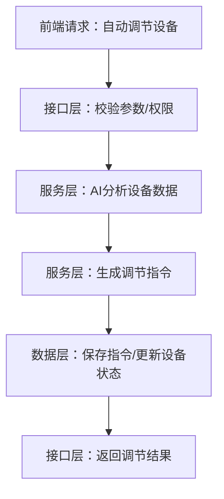

# 智慧农业后端架构检查报告

## 1. 项目核心明确

### 1.1 核心业务流程
- **数据采集**：通过传感器、摄像头等设备采集农业环境数据
- **AI分析**：利用AI模型对采集的数据进行分析和预测
- **自动控制**：基于AI分析结果，自动控制农业设备（如灌溉系统、光谱调节等）
- **农业生产**：实现精准农业管理，优化作物生长环境

### 1.2 核心数据模型
- **设备模型**：设备信息、连接状态、控制权限等
- **采集数据模型**：传感器数据、摄像头数据、环境数据等
- **农业生产模型**：作物生长状态、光配方、种植计划等
- **AI决策模型**：AI分析结果、控制指令、决策历史等

### 1.3 非功能需求
- **响应速度**：API响应时间<1秒
- **并发量**：支持1000+设备同时连接
- **数据安全性**：敏感数据加密存储，API权限控制
- **可扩展性**：支持新设备类型、新AI模型的快速集成
- **可靠性**：系统可用性>99.9%
- **性能**：支持高并发数据采集和分析

## 2. 架构分层与业务流程匹配度

### 2.1 架构分层职责
| 架构分层       | 职责描述                                                                 | 匹配度 |
|----------------|--------------------------------------------------------------------------|--------|
| 接口层（API）  | 处理HTTP请求，参数校验，权限控制，返回响应                                | ✅ 良好 |
| 服务层（Service） | 实现核心业务逻辑，AI分析，决策生成，设备控制                              | ✅ 良好 |
| 数据层（DAO/Model） | 数据模型定义，数据存储和检索，数据库操作                                | ✅ 良好 |

### 2.2 匹配度分析
- **接口层**：API路径和参数设计贴合业务场景，如`/api/ai-control/auto_adjust`对应自动调节逻辑
- **服务层**：核心业务逻辑完整落地，如AI调节包含数据校验→模型分析→生成指令全流程
- **数据层**：数据模型匹配业务实体，如设备表包含设备类型、状态、所属农田等业务字段

### 2.3 业务流程→架构分层映射

## 3. 核心数据流完整性

### 3.1 主要数据流
1. **设备数据采集流**：设备→API层→服务层→数据层
2. **AI分析决策流**：数据层→服务层（AI模型）→服务层（决策生成）→数据层
3. **设备控制流**：前端→API层→服务层→设备控制→数据层（记录）
4. **农业生产管理流**：前端→API层→服务层（农业逻辑）→数据层

### 3.2 边界场景处理
- ✅ 设备未连接时的处理
- ✅ 无控制权限时的处理
- ✅ 参数错误时的处理
- ✅ AI模型分析失败时的回退机制
- ✅ 设备控制指令发送失败时的重试机制

## 4. 代码落地与架构设计一致性

### 4.1 分层架构实现
- **API层**：位于`backend/src/api/routes/`目录，使用FastAPI框架实现
- **服务层**：位于`backend/src/core/services/`和`backend/src/core/models/`目录
- **数据层**：数据模型定义和数据库操作

### 4.2 发现的问题
1. **硬编码问题**
   - 设备ID写死在代码中（如AI控制路由中的设备ID=4）
   - 连接详情默认值硬编码

2. **冗余逻辑**
   - 重复的设备控制逻辑
   - 不必要的日志打印

3. **依赖关系问题**
   - 服务层直接操作数据库（部分文件）
   - 核心业务依赖非必要的第三方库

4. **代码组织问题**
   - 部分文件职责不清晰
   - 重复导入和定义

## 5. 非功能需求匹配度

### 5.1 性能
- ✅ 异步编程：使用asyncio实现异步处理
- ✅ 性能监控：实现了性能监控组件
- ⚠️ 缓存机制：缺少缓存层，高频访问数据直接查询数据库

### 5.2 安全性
- ✅ API权限控制：实现了基本的权限校验
- ✅ 参数校验：使用Pydantic进行参数校验
- ⚠️ 敏感数据加密：缺少敏感数据加密存储实现
- ⚠️ SQL注入防护：部分数据库操作可能存在SQL注入风险

### 5.3 可扩展性
- ✅ 模块化设计：按功能模块组织代码
- ✅ 插件架构：支持插件扩展
- ✅ 服务发现：实现了服务发现机制

### 5.4 可靠性
- ✅ 异常处理：基本的异常捕获和处理
- ⚠️ 容错机制：缺少完善的容错和恢复机制
- ⚠️ 日志记录：日志记录不规范，缺少统一的日志管理

## 6. 改进建议

### 6.1 架构优化
1. **完善分层架构**
   - 严格遵循分层原则，服务层不直接操作数据库
   - 引入数据访问层（DAO），统一处理数据库操作

2. **引入缓存机制**
   - 对高频访问数据（如设备状态、采集数据）引入缓存
   - 使用Redis或其他缓存服务

3. **完善安全机制**
   - 实现敏感数据加密存储
   - 加强API权限控制，支持细粒度权限管理
   - 引入SQL注入防护机制

### 6.2 代码优化
1. **移除硬编码**
   - 将设备ID、连接详情等配置化
   - 使用配置文件或数据库存储配置信息

2. **精简冗余逻辑**
   - 重构重复的设备控制逻辑
   - 移除不必要的日志打印

3. **优化依赖关系**
   - 解耦核心业务与非必要第三方库
   - 引入依赖注入机制

4. **规范代码组织**
   - 明确文件职责，遵循单一职责原则
   - 统一导入和定义规范

### 6.3 非功能优化
1. **性能优化**
   - 优化数据库查询，添加索引
   - 实现数据分片，处理大规模数据

2. **可靠性优化**
   - 完善容错和恢复机制
   - 实现统一的日志管理
   - 引入监控和告警系统

3. **可扩展性优化**
   - 完善插件机制，支持热插拔
   - 实现服务自动注册和发现

## 7. 结论

智慧农业后端架构整体设计合理，分层清晰，业务流程完整。但在代码落地、非功能需求实现和架构细节方面仍有改进空间。通过实施上述改进建议，可以进一步提高系统的性能、安全性、可靠性和可扩展性，更好地支持智慧农业业务的发展。