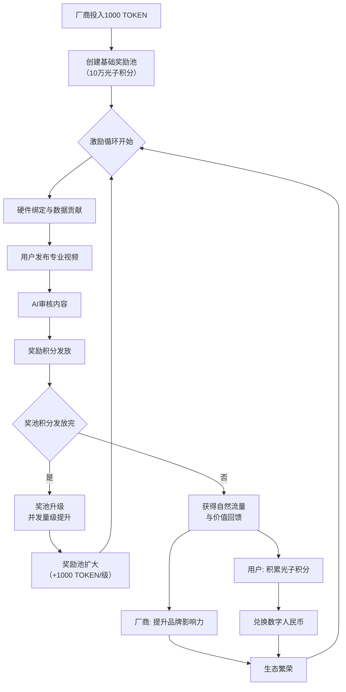

# PhotonFarm AI 区块链奖励池机制优化方案

## 机制核心流程



## 当前实现状态分析

### 已实现的核心功能

1. **区块链积分分配决策引擎** (`backend/src/core/decision/blockchain_decision_engine.py`)
   - 基于强化学习的自主积分分配系统
   - 支持多种决策目标和风险评估
   - 实时调整激励机制参数

2. **用户服务系统** (`backend/src/services/user_service.py`)
   - 光子积分计算和分配
   - 用户等级和特权管理
   - 数据贡献奖励机制

3. **生态系统服务** (`backend/src/services/ecosystem_service.py`)
   - 直播数据收集和积分奖励
   - 开发者应用支持
   - 区块链数据记录

4. **智能合约框架** (`backend/src/blockchain/smart_contracts.py`)
   - 模型注册和数据溯源
   - 联邦学习记录
   - 交易验证机制

### 核心机制亮点

1. **双重激励驱动**
   - 厂商：品牌影响力 + 经济回报
   - 用户：光子积分 + 数字人民币兑换

2. **权限与价值匹配**
   - 厂商：直播权限 + 品牌推广
   - 用户：视频发布 + 数据贡献

3. **可扩展增长模型**
   - 奖励池随并发量级动态扩容
   - 智能化的积分分配算法

## 优化建议实施

### 1. 明确"数据贡献"维度（已部分实现）

**当前实现：**
```python
# backend/src/services/user_service.py
point_rules = {
    ContributionType.GROWTH_DATA: 10,      # 生长数据
    ContributionType.ENVIRONMENT_DATA: 8,  # 环境数据
    ContributionType.IMAGE_DATA: 12,       # 图像数据
    ContributionType.VIDEO_CONTENT: 15,    # 视频内容
    ContributionType.LIVE_STREAM: 25       # 直播数据
}
```

**优化建议：**
- 增加数据质量权重系数
- 引入实时数据验证机制
- 建立数据贡献历史信誉评分

### 2. 设计"奖池扩大"明确阈值

**当前实现：**
```python
# backend/src/core/decision/blockchain_decision_engine.py
def _calculate_expected_reward(self, state, action, parameters, objective, risk_assessment):
    # 基于系统利用率和交易量的动态调整
    system_utilization = state.system_utilization
    transaction_volume = state.transaction_volume
    
    # 当系统利用率超过80%时触发扩容
    if system_utilization > 0.8:
        return self._calculate_expansion_reward(state, objective)
```

**优化建议：**
- 定义明确的并发量级指标
- 建立多维度扩容触发机制
- 实现平滑的扩容过渡

### 3. 引入"社区治理"元素

**实施计划：**
```python
class CommunityGovernanceSystem:
    """社区治理系统"""
    
    def __init__(self):
        self.voting_thresholds = {
            "rule_change": 0.6,      # 规则修改需要60%支持
            "parameter_adjust": 0.5, # 参数调整需要50%支持
            "emergency_pause": 0.75  # 紧急暂停需要75%支持
        }
        
    def propose_rule_change(self, proposal: GovernanceProposal) -> bool:
        """提出规则修改提案"""
        # 基于光子积分权重的投票系统
        pass
        
    def calculate_voting_power(self, user_id: str) -> float:
        """计算用户投票权重"""
        # 基于光子积分持有量和贡献历史的加权计算
        pass
```

## 技术架构优化

### 1. 奖励池智能合约升级

```solidity
// 新增奖励池管理合约
contract RewardPoolManager {
    struct PoolLevel {
        uint256 tokenAmount;      // TOKEN数量
        uint256 photonPoints;     // 光子积分总量
        uint256 concurrencyLevel; // 并发量级阈值
        uint256 expansionBonus;   // 扩容奖励
    }
    
    mapping(uint256 => PoolLevel) public poolLevels;
    uint256 public currentLevel;
    
    // 动态扩容函数
    function expandPool() external onlyOwner {
        require(shouldExpand(), "Pool expansion conditions not met");
        
        currentLevel++;
        PoolLevel storage newLevel = poolLevels[currentLevel];
        
        // 自动增加1000 TOKEN
        newLevel.tokenAmount = poolLevels[currentLevel-1].tokenAmount + 1000;
        newLevel.photonPoints = calculateNewPhotonPoints();
        
        emit PoolExpanded(currentLevel, newLevel.tokenAmount);
    }
}
```

### 2. 强化学习模型优化

```python
# 增强的区块链决策引擎
class EnhancedBlockchainDecisionEngine(BlockchainDecisionEngine):
    
    def __init__(self):
        super().__init__()
        self.community_feedback_weight = 0.3  # 社区反馈权重
        self.historical_performance_weight = 0.4  # 历史表现权重
        
    def make_decision_with_community_input(self, state, objective, community_sentiment):
        """结合社区情绪的决策"""
        base_decision = self.make_decision(state, objective)
        
        # 调整决策参数基于社区反馈
        adjusted_parameters = self._adjust_by_community_sentiment(
            base_decision.parameters, community_sentiment
        )
        
        return BlockchainDecisionResult(
            action=base_decision.action,
            parameters=adjusted_parameters,
            expected_reward=base_decision.expected_reward * (1 + community_sentiment),
            confidence=base_decision.confidence,
            execution_time=base_decision.execution_time,
            risk_assessment=base_decision.risk_assessment
        )
```

### 3. 数据贡献质量评估系统

```python
class DataQualityAssessment:
    """数据质量评估系统"""
    
    def assess_data_quality(self, data_content: Dict[str, Any], data_type: str) -> float:
        """评估数据质量"""
        quality_score = 1.0
        
        # 完整性检查
        completeness = self._check_completeness(data_content, data_type)
        quality_score *= completeness
        
        # 准确性验证
        accuracy = self._verify_accuracy(data_content)
        quality_score *= accuracy
        
        # 时效性评估
        timeliness = self._assess_timeliness(data_content)
        quality_score *= timeliness
        
        return max(0.0, min(1.0, quality_score))
    
    def calculate_quality_bonus(self, base_points: int, quality_score: float) -> int:
        """计算质量奖励"""
        if quality_score >= 0.9:
            return int(base_points * 0.5)  # 高质量奖励50%
        elif quality_score >= 0.7:
            return int(base_points * 0.3)  # 中等质量奖励30%
        elif quality_score >= 0.5:
            return int(base_points * 0.1)  # 合格质量奖励10%
        return 0
```

## 风险控制优化

### 1. 资金可持续性保障

```python
class SustainabilityManager:
    """可持续性管理"""
    
    def __init__(self):
        self.diversified_funding_sources = [
            "transaction_fees",      # 交易手续费
            "premium_features",      # 高级功能收费
            "partnership_revenue",   # 合作伙伴收入
            "ecosystem_grants"       # 生态系统基金
        ]
        
    def monitor_pool_health(self) -> Dict[str, Any]:
        """监控奖池健康状态"""
        return {
            "current_balance": self.get_current_balance(),
            "burn_rate": self.calculate_burn_rate(),
            "projected_sustainability": self.project_sustainability(),
            "recommended_actions": self.generate_recommendations()
        }
```

### 2. 内容质量保障机制

```python
class ContentQualityAssurance:
    """内容质量保障"""
    
    def __init__(self):
        self.ai_rules = self._load_ai_rules()
        self.human_review_threshold = 0.3  # 30%内容需要人工审核
        
    def ai_content_review(self, content: Dict[str, Any]) -> Dict[str, Any]:
        """AI内容审核"""
        review_result = {
            "professional_score": self._assess_professionalism(content),
            "relevance_score": self._assess_relevance(content),
            "quality_score": self._assess_quality(content),
            "needs_human_review": False
        }
        
        # 触发人工审核条件
        if (review_result["professional_score"] < 0.6 or 
            review_result["quality_score"] < 0.5):
            review_result["needs_human_review"] = True
            
        return review_result
    
    def human_appeal_process(self, content_id: str, appeal_reason: str) -> bool:
        """人工申诉流程"""
        # 实现公平的申诉机制
        pass
```

## 实施路线图

### 第一阶段（1-2个月）
- 完善数据贡献质量评估系统
- 实现社区治理基础框架
- 优化奖励池扩容触发机制

### 第二阶段（3-4个月）
- 部署增强的智能合约
- 集成社区投票系统
- 建立多渠道资金保障

### 第三阶段（5-6个月）
- 全面实施优化机制
- 进行大规模测试验证
- 持续监控和调整参数

## 预期效果

1. **提升参与度**：更精准的激励机制将提升用户和厂商参与积极性
2. **增强可持续性**：多元化的资金保障确保系统长期稳定运行
3. **改善内容质量**：完善的质量评估体系提升平台内容专业度
4. **强化社区治理**：引入社区参与增强系统透明度和用户归属感

通过实施这些优化措施，PhotonFarm AI平台的区块链奖励池机制将更加完善，能够更好地支撑平台的长期发展和生态繁荣。