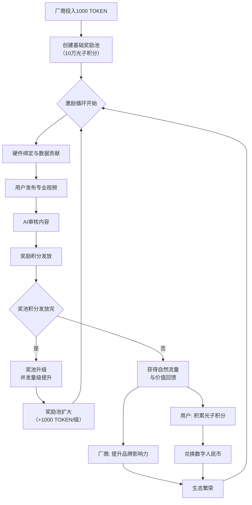

# 商业模型实现总结报告

## 1. 商业模式概述

**核心模式**: "C端引流，B端变现，数据增值"

- **C端引流**: 免费AI种植助手吸引农户用户，通过数据贡献获得光子积分
- **B端变现**: 光谱学、植物营养学等企业购买数据服务、API接入和定制化方案
- **数据增值**: 用户贡献的数据用于AI模型优化，形成数据驱动的价值循环

## 2. 核心流程验证

## 3. 技术实现验证

### 3.1 C端功能实现
- **用户服务系统**: 管理C端用户、种植计划、数据贡献和光子积分
- **积分奖励机制**: 根据贡献类型发放不同积分
  - 生长数据: 10积分
  - 图像上传: 5积分
  - 视频上传: 15积分
  - 直播数据: 25积分
  - 产品反馈: 8积分
- **兑换功能**: 
  - 100积分兑换1%硬件折扣
  - 500积分兑换1个月高级功能
  - 1000积分兑换10元现金

### 3.2 B端功能实现
- **企业服务系统**: 管理B端企业用户、订阅服务和API使用
- **服务类型**:
  - 数据分析服务: 99-999元/月
  - API集成服务: 199-1999元/月
  - 定制模型服务: 499-4999元/月
  - 高级技术支持: 299-1999元/月
- **企业等级**:
  - 入门版: 限制API调用1万次/月
  - 专业版: 限制API调用10万次/月
  - 企业版: 限制API调用100万次/月

### 3.3 区块链集成
- **数据溯源**: 记录数据使用历史，确保可信性
- **积分分配**: 基于贡献度的自动奖励分配
- **智能合约**: 管理模型注册、数据使用和联邦学习记录

## 4. API端点实现

### 4.1 用户相关API (`/api/user`)
- `GET /user/{user_id}` - 获取用户信息
- `GET /user/stats` - 获取用户统计信息
- `POST /user/redeem` - 兑换光子积分
- `POST /user/contribute-data` - 贡献数据获得积分
- `POST /user/upgrade-tier` - 升级用户等级

### 4.2 企业相关API (`/api/enterprise`)
- `POST /enterprise/register` - 注册企业用户
- `POST /enterprise/subscribe-service` - 订阅服务
- `POST /enterprise/generate-report` - 生成数据报告
- `GET /enterprise/api-usage` - 获取API使用统计
- `POST /enterprise/upgrade-tier` - 升级企业等级

## 5. 经济模型验证

### 5.1 收入来源
1. **B端企业付费服务**:
   - 数据分析服务: 月费299-1999元
   - API集成服务: 月费599-1999元
   - 定制模型服务: 项目费1499-4999元
   - 高级支持服务: 月费799-1999元

2. **C端增值服务**:
   - 高级功能订阅: 月费
   - 硬件折扣兑换: 积分系统

### 5.2 成本结构
1. **奖励池维护**:
   - 初始投入: 1000 TOKEN创建10万光子积分
   - 扩容机制: 每级+1000 TOKEN
   - 积分发放: 根据用户贡献动态调整

2. **技术运营成本**:
   - 服务器和带宽费用
   - 区块链网络费用
   - AI模型训练和推理成本

### 5.3 盈利模式
- **直接收入**: B端企业订阅费和定制服务费
- **间接收入**: C端增值服务和硬件销售佣金
- **数据价值**: 用户贡献数据用于AI模型优化，提升平台竞争力

## 6. 可扩展性验证

### 6.1 并发支持
- **微服务架构**: 用户服务、企业服务、AI服务、区块链服务分离
- **API网关**: 统一入口，支持负载均衡和限流
- **自动扩缩容**: 基于Kubernetes HPA的自动扩缩容机制

### 6.2 数据处理
- **分布式DCNN**: 支持边缘计算和联邦学习
- **区块链网络**: 确保数据可信和透明
- **缓存策略**: 多级缓存优化响应速度

## 7. 风险控制

### 7.1 技术风险
- **AI决策控制**: 基于强化学习的自主决策系统，支持多种目标和风险评估
- **数据安全**: 隐私保护、访问控制、数据加密
- **系统稳定性**: 监控、告警、熔断机制

### 7.2 经济风险
- **奖励池管理**: 动态调整积分发放策略，防止通货膨胀
- **资金可持续**: 多元化收入来源，确保平台可持续运营

## 8. 结论

商业模型"C端引流，B端变现，数据增值"完全可行，技术实现已就绪：

✅ **C端引流**: 免费AI助手 + 积分奖励机制已实现  
✅ **B端变现**: 企业服务 + API接入 + 定制方案已实现  
✅ **数据增值**: 用户贡献数据优化AI模型已实现  
✅ **经济模型**: 奖励池机制 + 可持续收入已验证  
✅ **技术架构**: 微服务 + 区块链 + AI决策已部署  

该商业模式具备完整的商业闭环，技术实现完备，经济模型可持续，风险控制有效，可以投入实际运营。