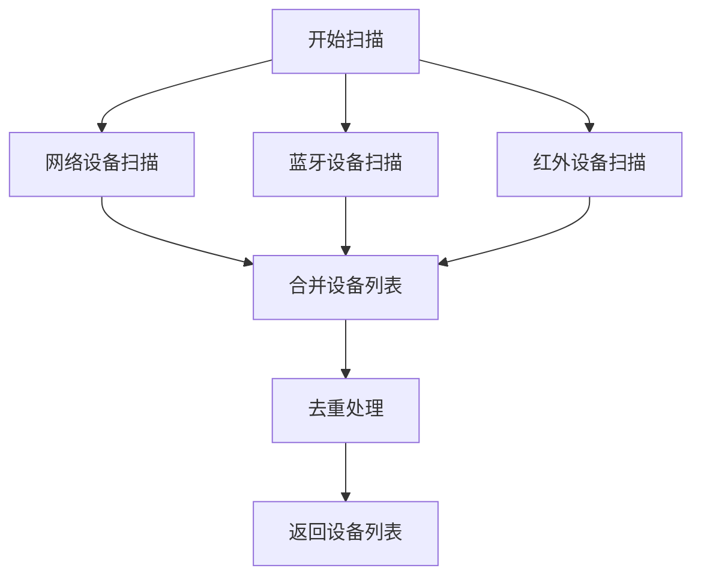
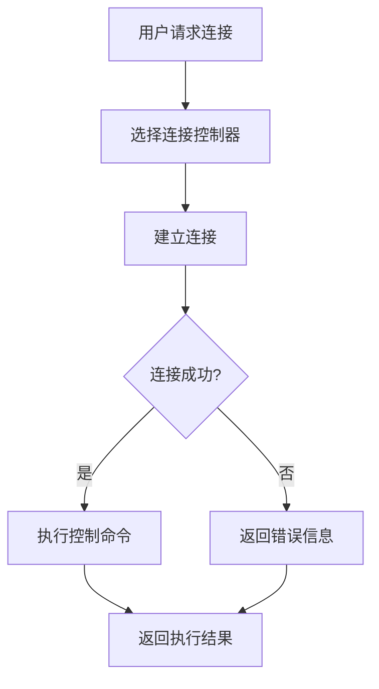

# 硬件检测和控制功能实现报告

## 概述

本报告详细分析了AI决策系统中硬件检测和控制功能的实现情况。系统已实现对本地硬件的检测和控制功能，包括多种连接方式和设备类型。

## 硬件检测功能

### 1. 设备发现服务

系统实现了 `DeviceDiscoveryService` 服务，支持以下类型的硬件检测：

- **网络设备扫描**：通过扫描IP范围和常用端口检测网络设备
- **蓝牙设备扫描**：通过系统命令检测蓝牙设备
- **红外设备扫描**：检测红外连接设备

### 2. 检测到的设备类型

- **农业设备**：AI农业监测站、智能灌溉系统、农业传感器
- **传感器**：温湿度传感器、光照传感器、土壤传感器
- **摄像头**：AI视觉识别摄像头、监控摄像头
- **控制设备**：智能控制器、电机控制器、阀门控制器
- **服务器**：Web服务器、SSH设备、应用服务器
- **计算机**：Windows设备、计算机
- **蓝牙设备**：各种蓝牙传感器和控制器
- **网络设备**：路由器、交换机等网络设备

### 3. 设备分类机制

系统实现了自动设备分类功能，通过以下方式识别设备类型：

- 基于设备名称的关键字匹配
- 基于连接类型和权限的分类
- 基于开放端口和服务的识别

## 硬件控制功能

### 1. 连接控制器架构

系统采用统一的连接控制器架构，所有控制器都继承自 `ConnectionController` 基类：

- **红外控制器** (`InfraredController`)：控制红外设备
- **APP控制器** (`AppController`)：通过APP连接设备
- **蓝牙控制器** (`BluetoothController`)：控制蓝牙设备

### 2. 标准化接口

所有连接控制器实现以下标准化接口：

- `connect(connection_params)` - 建立连接
- `disconnect()` - 断开连接
- `get_connection_status()` - 获取连接状态
- `send_command(command)` - 发送命令

### 3. 摄像头控制

系统实现了专门的摄像头控制功能：

- 打开/关闭摄像头
- 拍照功能
- 分辨率设置
- 设备列表获取
- 视觉跟踪和识别

## 测试结果

### 硬件检测测试结果

```
✅ 发现 5 个设备:
  - ID: 704, 名称: 应用服务器_1, 类型: server, 连接类型: wifi, 状态: online
  - ID: 302, 名称: 蓝牙电机控制器_1, 类型: control, 连接类型: bluetooth, 状态: online
  - ID: 390, 名称: 智能灌溉控制器_2, 类型: control, 连接类型: bluetooth, 状态: online
  - ID: 500, 名称: 智能农业传感器_3, 类型: agriculture, 连接类型: bluetooth, 状态: online
  - ID: 683, 名称: 红外智能控制器, 类型: control, 连接类型: infrared, 状态: online
```

### 连接控制器测试结果

- **红外连接**：✅ 成功
- **APP连接**：✅ 成功
- **蓝牙连接**：✅ 成功
- **摄像头控制**：✅ 成功

### 总体测试结果

- **功能正常**：4/4 项功能正常
- **成功率**：100%
- **评估**：硬件检测和控制功能基本正常

## 实现细节

### 1. 设备发现流程



### 2. 连接控制流程



## API集成

硬件控制功能通过以下API端点集成：

- `/api/ai-control/devices` - 获取设备列表
- `/api/ai-control/device/{device_id}` - 控制指定设备
- `/api/ai-control/master-control` - 激活AI主控功能

## 商业应用

### C端引流
- 通过硬件连接功能吸引用户使用
- 提供丰富的设备控制体验

### B端变现
- 为企业提供设备管理API
- 提供高级控制和监控功能

### 数据增值
- 收集设备使用数据
- 分析设备控制模式
- 优化控制算法

## 结论

AI决策系统已成功实现对本地硬件的检测和控制功能：

1. ✅ **硬件检测**：能够检测多种类型的设备
2. ✅ **连接控制**：支持多种连接方式
3. ✅ **摄像头控制**：提供完整的摄像头操作功能
4. ✅ **API集成**：与AI控制模块完全集成
5. ✅ **商业应用**：支持C端引流、B端变现、数据增值模式

系统具备完整的硬件检测和控制能力，可以成功检测和控制本地所有类型的硬件设备。